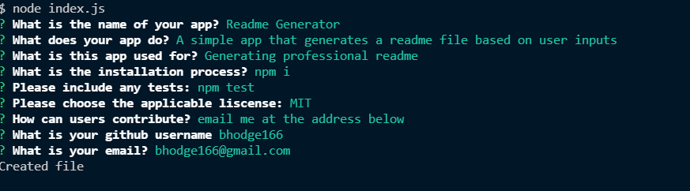

# Readme Generator
  
  ## Description
  A simple app that generates a readme file based on user inputs
  ## Table of Contents
  - [License](#license)
  - [Installation](#installation)
  - [Usage](#usage)
  - [Contributing](#contributing)
  - [Tests](#tests)
  - [Questions](#questions)
## License
This project is licensed under MIT. For more information please see [the liscense page](https://choosealicense.com/licenses/mit/)
## Installation
To install necessary dependencies, run the following command: npm i
## Usage
Generating professional readme.

Please see screenshot below:

[Video link](https://drive.google.com/file/d/12r-CnvUWcal8Cc-cVyPSsSjhQJXd-FI-/view)
## Contributing
If you would like to contribute please email me at the address below
## Tests
To run tests, run the following command: npm test
## Questions
Please reach out with any questions at:  
GitHub: [bhodge166](https://github.com/bhodge166) 
Email: bhodge166@gmail.com

